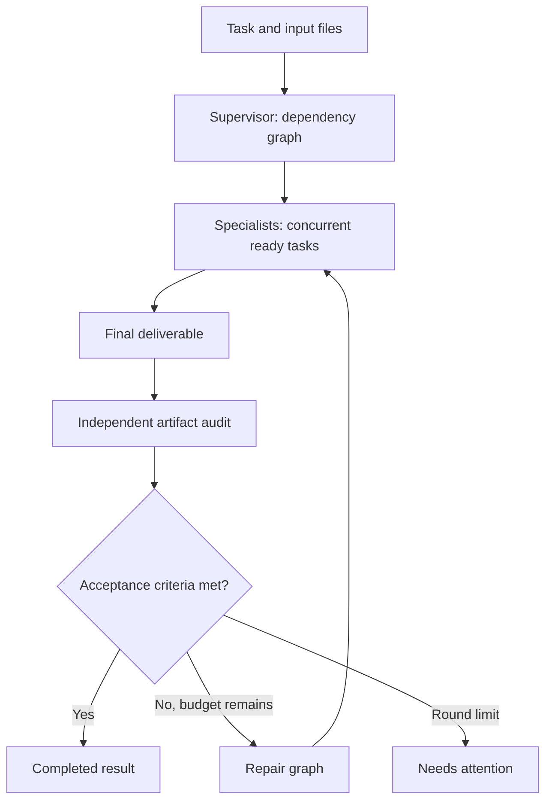

# Waypost Swarm

A local autonomous task engine built with **Swarms 15.0.3** agents. Every
agent uses a custom LLM adapter pointed at Waypost. Provider selection,
free-tier quotas, retries and local fallback remain Waypost's responsibility.
This is an optional module; installing/running the router does not start a swarm.

## Topology



The supervisor chooses specialties, instructions, dependencies and acceptance
criteria for each task. A graph wave executes up to `concurrency` specialists
at once. Downstream tasks receive dependency answers. Workers can inspect files,
write deliverables and optionally run Python. The synthesizer produces the answer;
a separate read-only agent audits it; a verdict agent either accepts it or builds
a repair graph. Original acceptance criteria survive repair rounds.

Swarms supplies the actual `Agent` execution and prompt handling. Waypost's
engine owns graph scheduling, the structured action/tool loop, validation,
checkpointing and budgets. It does not use the hosted Swarms API or require a
Swarms API key. Framework telemetry is disabled before importing Swarms.

## Install and run

Python 3.11+ on macOS/Linux. In the Waypost repository:

```bash
python3 -m venv .venv
source .venv/bin/activate
pip install -e '.[swarm]'
```

Start the configured Waypost server in one terminal:

```bash
python -m waypost.server
```

In another terminal using the same environment:

```bash
waypost-swarm run \
  --task 'Design a Python library for invoice validation. Write the implementation, tests, and usage guide. Review the result against explicit acceptance criteria.' \
  --run-dir var/swarm/invoice-library
```

Use `python -m waypost.swarm` if the console script is not on PATH.
Waypost must have at least one working upstream or local model. An installed
router alone does not supply inference.

For numerical/data tasks, supply files and optionally allow Python:

```bash
waypost-swarm run \
  --task 'Analyze sales.csv, check totals and missing values, write a report with reproducible calculations and a CSV of results.' \
  --input sales.csv \
  --allow-python \
  --run-dir var/swarm/sales-analysis
```

`--allow-python` runs model-generated code **as your OS user**, with a 30-second
per-command timeout and captured output. It is not a sandbox: code can access
the filesystem and network. Use a container/VM for untrusted tasks. Without the
flag, only bounded file listing/reading and per-agent file writing are available.
The reviewer has only listing/reading tools, even if Python is enabled.

### Configuration

```bash
waypost-swarm run --task-file task.txt \
  --base-url http://127.0.0.1:8080/v1 \
  --model auto --privacy strict --concurrency 1 \
  --max-tasks 12 --max-rounds 3 --max-steps 10 \
  --max-calls 100 --max-tokens 4096 --max-seconds 3600 \
  --request-timeout 310
```

- `WAYPOST_BASE_URL` sets the CLI default endpoint.
- `WAYPOST_API_KEY` is optional, for a protected router deployment; the default
  value is `unused`. Keys are never written into configuration checkpoints.
- `privacy strict` delegates local-only routing to Waypost. Otherwise the router
  applies its normal policy, including automatic PII detection.
- `concurrency 1` is useful when the local model is the main source of inference.
- Every request uses `latency_class=batch`, `no_cache=true`, a role-specific
  session ID, JSON output mode and a unique idempotency key.
- `max_calls` counts requests to Waypost, including invalid-output correction
  attempts. It does not count internal provider retries or measure dollar cost.
- `max_tokens` caps requested output tokens per call, not total prompt tokens.
- Time is checked between steps and used to bound HTTP/tool timeouts. It is a
  cooperative budget, not a hard process-kill deadline; an in-flight HTTP call
  can exceed the remaining wall time. Elapsed time and call counts persist on resume.

## Outputs and recovery

Each run directory contains:

| Path | Contents |
|---|---|
| `state.json` | Atomic checkpoint: graph, completed work, observations, counters, reviews |
| `events.jsonl` | Tool actions/results and router diagnostics/usage |
| `result.md` | Latest synthesized deliverable, including a partial draft on review failure |
| `workspace/inputs/` | Copies of supplied files |
| `workspace/artifacts/r1/<task>/` | Per-specialist output files; later rounds use r2, r3, etc. |

```bash
waypost-swarm status var/swarm/sales-analysis
waypost-swarm resume var/swarm/sales-analysis
```

Resume uses the saved settings and skips completed tasks. A run lock prevents
two processes from resuming the same run concurrently. Failed HTTP calls can be
retried through resume; execution budgets are not reset.

If a process stops during a tool call, the checkpoint marks its outcome unknown.
Inspect artifacts and the journal before continuing:

```bash
waypost-swarm resume var/swarm/sales-analysis --acknowledge-interrupted-tools
```

This records an unknown outcome and asks the agent to inspect before repeating
work. It does **not** guarantee exactly-once external effects.

`completed` means the model reviewer accepted the result. `needs_attention`
means repair rounds were exhausted; `budget_exhausted` means a call/step/time
limit was hit; `failed` and `interrupted` runs can be resumed. Completed and
budget/review-exhausted runs are terminal. Start a new run with larger limits
and supply previous deliverables as input if more work is needed. CLI exit code
is 0 for completed runs and 2 otherwise; `status` itself exits 0.

Check the status alongside `result.md`: a draft file alone is not a success flag.
The journal and checkpoints contain task/file contents; keep the run directory private.

## Current scope

- Autonomous planning, local document/code generation, supplied-file analysis,
  synthesis and iterative review.
- No built-in browser, web search, email, deployment, MCP or distributed workers.
  The default tools cannot research live sources or perform external actions.
- Review is LLM-based and can be wrong. This is a runnable initial engine, not a
  guarantee that arbitrary complex tasks will be solved correctly.
- Text inputs only; file reads are bounded to 2 MB, with 20,000-character pages.
  Dependency summaries in synthesis are bounded to 8,000 characters per result;
  complete tool history/answers remain in the checkpoint. Very large tasks should
  be split or use explicit artifacts to avoid context-window overflow.
- Python dependencies/tools are those installed in the active environment.

## Python API

```python
from waypost.swarm import SwarmConfig, SwarmEngine

engine = SwarmEngine("var/swarm/example", SwarmConfig(concurrency=2))
state = engine.run("Create a documented implementation of a CSV reconciliation tool")
print(state["status"], state.get("draft"))
```

## Verification

```bash
pip install -e '.[dev,swarm]'
python -m pytest tests/test_swarm.py -q
python -m pytest -q
```

The suite exercises DAG validation/dependencies/concurrency, file tools, Python
timeouts, repair, budget stops, failure recovery, and a real Swarms `Agent` with
a mocked Waypost HTTP response. It spends no provider quota. Live model quality
requires a running, configured Waypost instance and representative user tasks.
